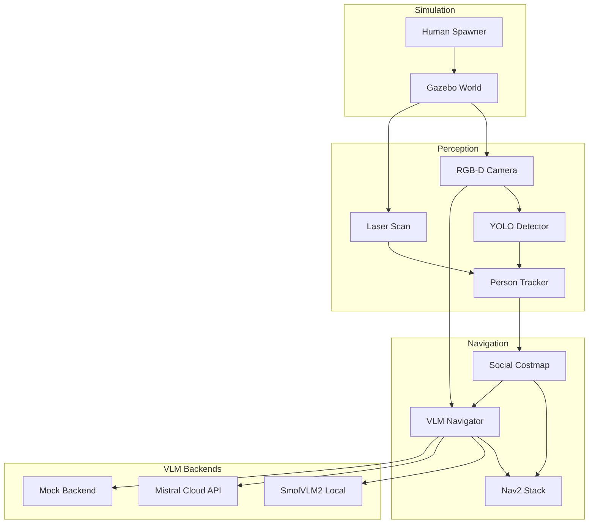

# TIAGoPro Social Navigation with Explainable VLM

A ROS 2 project for TIAGo Pro robot implementing **Explainable Social Navigation** using Vision-Language Models (VLMs). This project enables the robot to navigate socially around humans while providing natural language explanations for its navigation decisions.

Developed as a group project at **Aalborg University**.

---

## Table of Contents

1. [Overview](#overview)
2. [Architecture](#architecture)
3. [Prerequisites](#prerequisites)
4. [Quick Start](#quick-start)
5. [Docker Setup](#docker-setup)
6. [Bash Scripts](#bash-scripts)
7. [Docker Aliases](#docker-aliases)
8. [Package Structure](#package-structure)
9. [How It Works](#how-it-works)
10. [Running Experiments](#running-experiments)
11. [Useful Commands](#useful-commands)
12. [Troubleshooting](#troubleshooting)

---

## Overview

This system combines:

- **Human Detection & Tracking**: YOLO-based person detection fused with laser scan clustering
- **Social Costmaps**: Dynamic costmaps that represent social zones around detected humans
- **VLM-Powered Navigation**: Vision-Language Models analyze the scene and provide navigation commands with natural language explanations
- **Multiple VLM Backends**: Support for local (SmolVLM2) and cloud (Mistral) inference

---

## Architecture



---

## Prerequisites

### Required

1. **Docker and Docker Compose** - For containerized development
2. **NVIDIA Docker Runtime** - For GPU acceleration (required for local VLM inference)
3. **PAL Robotics TIAGo Pro Docker Image**: `development-tiago-pro-34:alum-25.01`
   
   > [!IMPORTANT]
   > You must have access to the official PAL Robotics Docker image. This is typically provided through PAL's developer program or academic partnerships.

4. **X Server** - For GUI display (Gazebo, RViz)
   - Linux: Usually available by default
   - WSL2: Requires X server like VcXsrv or WSLg

### Environment Configuration

Create a `.env` file in the project root with your API keys:

```bash
# Required for Mistral cloud VLM backend
MISTRAL_API_KEY=your_mistral_api_key_here
```

> [!NOTE]
> The `.env` file is gitignored for security. You must create it manually.
> Get your Mistral API key from [console.mistral.ai](https://console.mistral.ai)

---

## Quick Start

```bash
# 1. Clone the repository
git clone <repository-url>
cd TIAGoPro_Group_Project_163

# 2. Create your .env file with Mistral API key
echo "MISTRAL_API_KEY=your_key_here" > .env

# 3. Build and start the Docker container
./restart.sh

# 4. Enter the container
./start.sh

# 5. Inside the container: launch the simulation
ros2 launch tiago_social_sim simulation.launch.py navigation:=True slam:=True
```

---

## Docker Setup

### Base Image

The project uses PAL Robotics' official TIAGo Pro development image as the base:

```dockerfile
FROM development-tiago-pro-34:alum-25.01
```

### What's Installed

| Category | Packages |
|----------|----------|
| **ROS 2 Core** | `ros-humble-launch`, `ros-humble-launch-ros`, `ros-humble-ament-cmake` |
| **Navigation** | `ros-humble-robot-localization`, `ros-humble-image-pipeline` |
| **ML/Vision** | PyTorch, TorchVision, Ultralytics (YOLO), Transformers |
| **VLM** | `mistralai`, `accelerate`, SmolVLM2 dependencies |

### Docker Compose Configuration

The `docker-compose.yml` provides:

- **NVIDIA Runtime**: GPU acceleration for YOLO and local VLM inference
- **Host Network**: Seamless ROS 2 communication
- **X11 Forwarding**: GUI support for Gazebo and RViz
- **Volume Mounts**: 
  - `./src` → `/home/user/src` (your code)
  - X11 socket for display forwarding
- **Environment Variables**: Display, API keys from `.env`

---

## Bash Scripts

| Script | Purpose | Usage |
|--------|---------|-------|
| `restart.sh` | Full rebuild: stops container, rebuilds image, starts fresh | `./restart.sh` |
| `start.sh` | Enter the running Docker container | `./start.sh` |
| `run_experiments.sh` | Automated experiment suite runner | `./run_experiments.sh` |

### restart.sh

Convenience script for complete Docker lifecycle management:

```bash
#!/bin/bash
# 1. Stops existing containers
# 2. Rebuilds the Docker image
# 3. Starts the container in detached mode
# Logs are saved to src/tmp/setup.log
```

### start.sh

Quick entry into the running container:

```bash
#!/bin/bash
docker compose exec -it tiago_sim bash
```

### run_experiments.sh

Automated experiment runner that:

- Runs multiple experiment configurations in sequence
- Restarts Docker between experiments for clean state
- Records rosbags for each experiment
- Supports 4 experiment types: `novlm`, `smol`, `mistral`, `notrack`

---

## Docker Aliases

The following aliases are available inside the Docker container (defined in the Dockerfile):

| Alias | Command | Description |
|-------|---------|-------------|
| `build` | `colcon build --symlink-install && source install/setup.bash` | Build workspace and source it |
| `src` | `source install/setup.bash` | Source the workspace |
| `start_sim` | `ros2 launch tiago_social_sim simulation.launch.py navigation:=True slam:=True world_name:=simple_office &> ~/src/tmp/output.log` | Launch simulation with default settings |

### Usage

```bash
# Inside Docker container:

# Build and source your workspace
build

# Just source (after manual build)
src

# Quick simulation start
start_sim
```

---

## Package Structure

```
TIAGoPro_Group_Project_163/
├── docker/
│   ├── Dockerfile              # Container definition
│   └── entrypoint.sh           # Startup script (sources ROS, builds workspace)
├── docker-compose.yml          # Container orchestration
├── .env                        # API keys (create manually, gitignored)
├── requirements.txt            # Python dependencies
├── restart.sh                  # Rebuild & restart Docker
├── start.sh                    # Enter Docker container
├── run_experiments.sh          # Automated experiment runner
├── python_scripts/             # Analysis and utility scripts
│   ├── rosbag_analysis/        # Experiment data analysis
│   ├── vlm/                    # VLM testing scripts
│   └── ...
└── src/
    ├── human_spawner/          # Dynamic human spawning for simulation
    ├── tiago_social_sim/       # Main simulation launch files
    ├── tiago_social_nav/       # Social navigation (detection, tracking, costmaps)
    ├── tiago_social_vlm/       # VLM interface and navigation
    └── tiago_social_cmd/       # High-level command interface
```

### Package Details

#### `tiago_social_sim`
**Main simulation orchestrator**

- Launch files for bringing up the full simulation stack
- PAL configuration overrides for Nav2
- Behavior trees for navigation
- Coordinates all other packages

#### `tiago_social_nav`
**Perception and social navigation**

| Module | Description |
|--------|-------------|
| `person_detector.py` | YOLO-based human detection from RGB images |
| `person_localizer.py` | 3D localization using RGB-D depth |
| `tracking.py` | Multi-sensor person tracking with Hungarian algorithm matching |
| `social_costmap_node.py` | Main node fusing detection and tracking |
| `social_costmap_publisher.py` | Publishes social zones to Nav2 costmap |

#### `tiago_social_vlm`
**Vision-Language Model navigation**

| Module | Description |
|--------|-------------|
| `vlm_interface.py` | VLM backend abstraction (Mock, SmolVLM2, Mistral) |
| `vlm_navigator.py` | ROS 2 node handling VLM queries and speed control |

#### `tiago_social_cmd`
**Command interface**

- High-level navigation commands
- Experiment coordination
- Goal management

#### `human_spawner`
**Dynamic human simulation**

- Spawns walking humans in Gazebo
- Configurable paths and behaviors
- Realistic pedestrian models

---

## How It Works

### 1. Human Detection Pipeline

```
RGB Camera → YOLO Detection → Depth Registration → 3D Position (Map Frame)
                                                          ↓
Laser Scan → Leg Clustering ─────────────────────→ Person Tracker
                                                          ↓
                                               Tracked Persons List
```

The system uses **sensor fusion**:
- **YOLO**: Primary detection with high confidence
- **Laser**: Secondary tracking when YOLO loses sight
- **Hungarian Algorithm**: Optimal matching of detections to existing tracks
- **Confidence Decay**: Tracks fade out without YOLO confirmation

### 2. Social Costmap Generation

Tracked persons are used to generate social costmaps:
- Gaussian cost fields around each person
- Velocity-based prediction for path planning
- Integration with Nav2's costmap layers

### 3. VLM Navigation

```
RGB Image + Map Visualization + Navigation Metrics
                    ↓
              VLM Backend
                    ↓
    { action: "continue|slow|wait|avoid",
      explanation: "Person crossing ahead...",
      speed: 0.3 }
                    ↓
           Speed Limit Publisher → Nav2
```

**Three VLM backends available:**

| Backend | Type | Requirements | Latency |
|---------|------|--------------|---------|
| Mock | Testing | None | ~0ms |
| SmolVLM2 | Local GPU | NVIDIA GPU, ~4GB VRAM | ~1-2s |
| Mistral | Cloud API | MISTRAL_API_KEY in .env | ~2-4s |

### 4. Supervisor Mode

The VLM acts as a **supervisor**, not a controller:
- Nav2 handles path planning and obstacle avoidance
- VLM provides high-level guidance (slow down, wait, etc.)
- VLM explanations are logged for transparency

---

## Running Experiments

### Single Simulation

```bash
# Inside Docker container:
ros2 launch tiago_social_sim simulation.launch.py \
    navigation:=True \
    slam:=True \
    world_name:=simple_office \
    vlm_backend:=mistral \
    track_humans:=True
```

### Launch Arguments

| Argument | Default | Description |
|----------|---------|-------------|
| `navigation` | `True` | Enable Nav2 navigation stack |
| `slam` | `True` | Enable SLAM for mapping |
| `world_name` | `simple_office` | Gazebo world to load |
| `vlm_backend` | `mock` | VLM backend: `mock`, `smol`, `mistral` |
| `track_humans` | `True` | Enable human detection and tracking |
| `record` | `False` | Record rosbag during simulation |

### Automated Experiments

Run the full experiment suite from the **host** (not inside Docker):

```bash
./run_experiments.sh
```

This runs 4 configurations × 6 loops = 24 experiments:
- `novlm`: No VLM, standard Nav2
- `smol`: Local SmolVLM2 backend
- `mistral`: Cloud Mistral backend  
- `notrack`: No human tracking

Each experiment:
- Runs for 10 minutes
- Records a rosbag
- Restarts Docker for clean state

---

## Useful Commands

### Inside Docker Container

```bash
# Build workspace
build                          # or: colcon build --symlink-install

# Source workspace
src                            # or: source install/setup.bash

# Launch simulation
start_sim                      # Quick launch with defaults

# Custom launch
ros2 launch tiago_social_sim simulation.launch.py navigation:=True slam:=True

# Check running nodes
ros2 node list

# Monitor topics
ros2 topic list
ros2 topic echo /tracked_persons

# View TF tree
ros2 run tf2_tools view_frames
```

### From Host

```bash
# Rebuild and restart Docker
./restart.sh

# Enter running container
./start.sh

# Run automated experiments
./run_experiments.sh

# Manual Docker commands
docker compose up -d           # Start container
docker compose down            # Stop container
docker compose logs -f         # View logs
```

---

## Troubleshooting

### Gazebo Doesn't Start / Display Issues

1. **Check X11 forwarding**:
   ```bash
   echo $DISPLAY           # Should show :0 or similar
   xhost +local:docker     # Allow Docker to access display
   ```

2. **WSL2 specific**:
   - Ensure WSLg is working or use VcXsrv
   - Set `DISPLAY` in `.env` if needed

3. **Software rendering** (if GPU issues):
   Already configured in `docker-compose.yml`:
   ```yaml
   LIBGL_ALWAYS_SOFTWARE=1
   ```

### NVIDIA Runtime Not Found

```bash
# Check if nvidia-docker is installed
docker info | grep -i runtime

# Install if missing
sudo apt-get install nvidia-docker2
sudo systemctl restart docker
```

### VLM Backend Errors

**Mistral**:
- Verify `MISTRAL_API_KEY` is set in `.env`
- Check API key validity at console.mistral.ai

**SmolVLM2**:
- Requires NVIDIA GPU with ~4GB VRAM
- First run downloads model weights (~3GB)
- Check GPU availability: `nvidia-smi`

### Package Build Failures

```bash
# Inside container, clean rebuild:
rm -rf build install log
colcon build --symlink-install
source install/setup.bash
```

### Shutdown Errors

Segmentation faults during shutdown (e.g., in `move_group` or `component_container`) are **known issues** with complex ROS 2 stacks and can be safely ignored if the simulation runs correctly.

---

## Available Worlds

Worlds can be found in `/opt/pal/alum/share/pal_gazebo_worlds/worlds`. Common options:

| World | Description |
|-------|-------------|
| `simple_office` | Basic office environment (default) |
| `tutorial_office` | Larger office with multiple rooms |
| `hospital` | Hospital corridor environment |
| `small_factory` | Industrial setting |
| `pal_office` | PAL Robotics office replica |

---

## License

This project was developed for academic purposes at Aalborg University.

---

## Acknowledgments

- **PAL Robotics** for TIAGo Pro simulation infrastructure
- **Ultralytics** for YOLO implementation
- **HuggingFace** for SmolVLM2 model
- **Mistral AI** for cloud VLM API